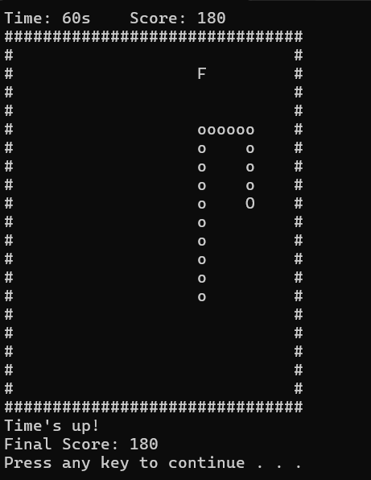

# 🐍 Classic Snake Game in C++ 🎮

**🔥 Classic Snake Game in C++ with a static box, tail growth, and fruit collection!**  
**⏱️ 60-second timer ⏱️ | 🏆 Score tracking | Fun console challenge!**

## 📸 Screenshot



## ⭐ Features

- 🟢 Classic snake mechanics: head `O`, tail `o`, fruit `F`  
- 📦 Static rectangular game box  
- ⏰ 60-second countdown timer  
- 💯 Score tracking  
- 🏎️ Smooth movement without screen flickering  
- 🎮 Controls:  
  - `W` = Up ⬆️  
  - `A` = Left ⬅️  
  - `S` = Down ⬇️  
  - `D` = Right ➡️  
  - `X` = Exit ❌

## 🛠️ How to Run

1. Clone the repository:
   ```bash
   git clone https://github.com/your-username/snake-game-cpp.git
